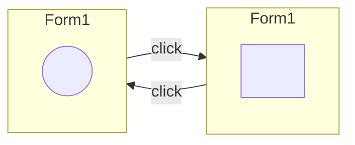
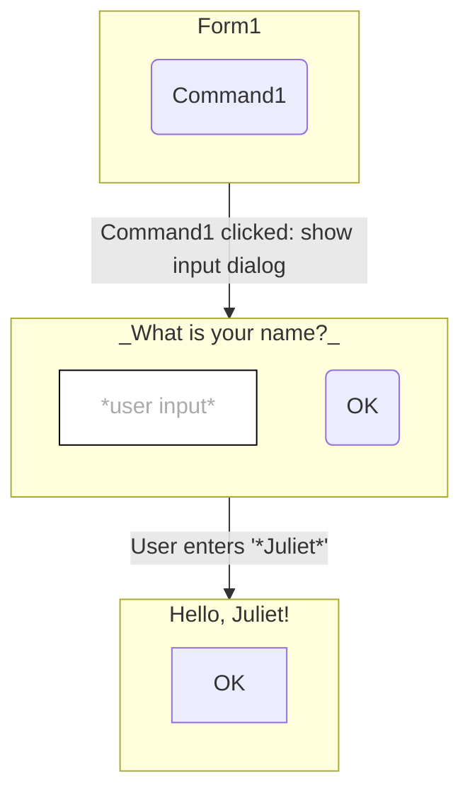

This repo is an extended profile for [@julietr](https://github.com/julietr).

My name is Juliet Rosenthal. I'm a professional code monkey in Omaha, Nebraska.

I primarily use C#, F#, PowerShell, and SQL (many flavors).

# How did you get into software?

## Short version:

In 1998 (age 11), my Dad helped me write my first syntax error. I started coding as a hobby.

In 2007 (age 19), I got my first programming job and started my career in IT.

Since then, I've produced, debugged, and polished millions of lines of production code.

## Long Version:

*(I've told a version of this story at least 1000 times. I enjoy telling this story.)*

I was 11 years old. Dad was taking his first computer science classes at the local community college. He was excited to show me his completed homework assignment:

Dad points to a gray window on the computer monitor. The window's title bar reads "Form1". Dad points to the shape of a square centered inside the form.

He clicks on the square: it turns into a circle.

He clicks on the circle: it turns back into a square.

He clicks a few times: it cycles between the two shapes.



_"Did you **make** that, Dad!"_ He did!

He closes the program. The gray form re-renders itself in "design mode" embedded within the Visual Basic 5 development environment. In the form designer, Dad shows me the properties and event handler of the `Shape` component. He navigates to a function like this:

```vb
Private Sub Shape1_Click()
    If Shape1.Shape = vbShapeSquare Then
        Shape1.Shape = vbShapeCircle
    ElseIf Shape1.Shape = vbShapeCircle Then
        Shape1.Shape = vbShapeSquare
    End If
End Sub
```

I'd never seen source code prior to Dad's homework assignment on conditionals. I had no working idea what `Private` or `Sub` meant, but the `If-Then` pattern made perfect sense. He showed me how IntelliSense/autocomplete functionality works, how to set the shape's line color and line weight. It was neat to see with my own eyes.

Dad tells me his homework assignment is written in Visual Basic. He creates a new project called `HelloWorld`. The project opens the drag-and-drop form designer. Dad drags a button from the toolbox onto the form. It renders with the default name `Command1`. He double-clicks the button, which creates an empty `Command1_Click` event handler in the form's code-behind. Dad fills in the event handler:

```vb
Private Sub Command1_Click()
    Dim userName As String

    userName = InputBox("Please enter your name:", "Name")

    If userName <> "" Then
        MsgBox "Hello, " & userName & "!"
    End If
End Sub
```

He executes the program in the debugger. The form and button render a new window. Dad clicks the button. An input dialog appears, prompting me to enter my name and press Enter. A second dialog displays with the familiar greeting.



He shows me some permutations of these programs: adding OK/Cancel buttons to the `MsgBox`, different event handlers (`Mouse_Down`, `Mouse_Over`).

Dad's simple, toy-like programs captivated my young mind. He encouraged me to copy the code snippets from his college textbooks into the IDE, tinker with the code, and see what I could do (or break). I started programming as a hobby.

Eventually, in 2007, my hobby spiraled out of control and became my career.

# See Also

## Daily Reads

* [Hacker News](https://news.ycombinator.com/): Aggregates news and articles of interest to software engineers and adjacent fields.

## .NET Resources

I highly recommend that programmers of all levels study these repositories. These are all great examples of SOLID architecture and abstraction:

* [YesSQL](https://github.com/sebastienros/yessql): Stores and indexes JSON documents behind a NoSQL-like interface.
* [Orchard Core](https://github.com/OrchardCMS/OrchardCore): A Content Management System (CMS) for .NET. Built on top of YesSQL.
* [Akka.NET](https://github.com/akkadotnet/akka.net) (a .NET port of [Pekko](https://github.com/apache/pekko)): An implementation of actor-model concurrency.
* [Reqnroll](https://github.com/reqnroll/Reqnroll) (a .NET port of [Cucumber](https://cucumber.io/docs)): A test automation framework that allows developers to write tests in a human-readable `Given`/`When`/`Then` format.

Additional resources for .NET developers to study:

* [.NET Design Patterns](https://dofactory.com/net/design-patterns): Inspired by the original Java "Gang of Four" patterns.
* [Regular Expressions](https://www.regular-expressions.info/tutorial.html): A comprehensive regex guide.
    * [Regex Tester](https://myregextester.com/): Great for debugging and prototyping regex patterns.
    * [.NET Regular Expressions](https://learn.microsoft.com/en-us/dotnet/standard/base-types/regular-expressions): Official MSDN documentation of .NET-flavored regex.

## Software and Tools

These tools have helped me out immensely throughout my career:

* [VS Code](https://code.visualstudio.com/download): Code editor and lightweight IDE.
* [PostgreSQL](https://www.postgresql.org/): Still the best open source relational database.
* [Notepad++](https://notepad-plus-plus.org/downloads/): A highly-capable alternative to Windows Notepad.
* [WinMerge](https://winmerge.org/): Diffs files and folders.
* [MermaidJS](https://mermaid.js.org/ecosystem/tutorials.html) ([Live Editor](https://mermaid.live/)): Diagrams, charts, and other visuals. Great for high-level, semi-formal documentation.
* [GraphViz](https://graphviz.org/): Diagrams and charts for highly precise engineering diagrams and data visualizations.

## Books

Here are some books which have inspired me:

* (2019) [Neural Networks and Deep Learning](http://neuralnetworksanddeeplearning.com/) by Michael Nielsen
* (1996) [Purely Functional Data Structures](https://www.cs.cmu.edu/~rwh/students/okasaki.pdf) by Chris Okasaki
* (2020) [The Algorithm Design Manual](https://www.algorist.com/) by Steven Skiena
* (2022) [Code: The Hidden Language of Computer Hardware and Software](https://www.charlespetzold.com/books/) by Charles Petzold

## Videos

Here are some videos and tech talks which have inspired me:

* [3blue1brown](https://www.3blue1brown.com/): A mathematician explains the visual intuition behind subjects that are often mathematically opaque, such as calculus, linear algebra, and large language models.
* [Concurrency in Newsqueak](https://www.youtube.com/watch?v=hB05UFqOtFA) by [Rob Pike](http://herpolhode.com/rob/): An implementation of message-passing concurrency.

## People

And some people who inspired me:

* [Lynn Conway](https://ai.eecs.umich.edu/people/conway/conway.html), a pioneer for trans women in computer science and software engineering.